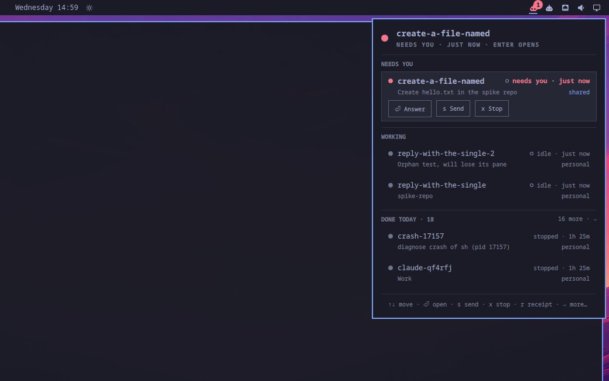

# Keepalive

Coding agents that stay running on your Omarchy desktop. Close the terminal, reboot, come back later. The session is still there.

Each session shows up in the Omarchy bar. The panel tells you who needs an answer, who is working, and what finished today. When an agent needs you, you get a notification. When a session ends, you get a receipt: the branch, the commits, the diff, the files it made, and your verdict.



Herdr, Omarchy's agent runtime, keeps the agent process alive. This plugin keeps the record. Every session has a folder under `~/.local/state/omarchy/sessions/` with a log of everything that happened. The bar, the commands, and the notifications all read from that folder.

## What you get

**A bar widget.** A robot icon. It turns red with a badge when a session needs you.

**A panel you can drive from the keyboard.** Arrows move. Enter opens the session, or answers it. `s` sends an instruction. `x` twice stops it. `r` shows the receipt. `p` focuses the session's preview window. `n` starts a new session: type what the agent should do, press Enter, and a terminal opens on it.

**Twenty commands.** All start with `omarchy-agent-session-`. The main ones are `new`, `list`, `open`, `send`, `stop`, `done`, `receipt`, and `show`. The rest handle names, goals, modes, previews, captures, and artifacts.

**Notifications.** "api-refactor needs you" when the agent asks a question or a permission. "api-refactor finished" when it is done; click it to see the receipt. "api-refactor stopped unexpectedly" when Herdr loses the process; click it to revive.

**Permission modes.** Personal: the agent runs without asking. Shared: the agent asks before it acts. Restricted: read-only tools. The plugin checks the launch command before it runs. Only Personal can skip prompts.

## Requirements

- Omarchy Quattro (4.0.x). I tested on the community aarch64 UTM port at commit `0b3f1b7`. I have not tested on x86.
- Herdr. Omarchy installs it.
- Python 3.11 or later.
- `grim` and `hyprctl`, for screen captures and window focus. Both come with Omarchy.
- A coding agent. I tested with Claude Code. Codex, OpenCode, and the others have permission tables and no live run yet.

## Install

```bash
omarchy plugin add https://github.com/mphaxise/omarchy-keepalive --enable
~/.config/omarchy/plugins/@PLUGIN_ID@/install.sh
```

The first command clones this repo into `~/.config/omarchy/plugins/@PLUGIN_ID@/` and puts the widget in the bar. The second links the commands into `~/.local/bin/` and installs two user units: one keeps the Herdr server running, one sends the notifications. It needs no root. It will not overwrite a file it did not create. Run it again after `omarchy plugin update`.

Keybindings are optional. Add these to `~/.config/hypr/bindings.lua` if you want them:

```lua
o.bind("SUPER + CTRL + G", "Keepalive", "omarchy-shell @PLUGIN_ID@ toggle")
o.bind("SUPER + CTRL + SHIFT + G", "Agent that needs you", "omarchy-shell @PLUGIN_ID@ openMostUrgent")
```

The plugin leaves Omarchy's own `omarchy-agent` keybinding alone. I have a version of `omarchy-agent` that creates a session and opens a terminal. It replaces Omarchy's command, so it stays out of this plugin. It is in the development repo under `bin/upstream-proposed/`.

## Use

```bash
omarchy-agent-session-new --agent claude --mode personal --name api-refactor --goal "Split the router into modules"
omarchy-agent-session-list
omarchy-agent-session-send api-refactor "Keep the public API unchanged"
omarchy-agent-session-open api-refactor          # opens a terminal; focuses the preview if there is one
omarchy-agent-session-preview api-refactor http://localhost:3000
omarchy-agent-session-done api-refactor --verdict kept --note "Reviewed the diff, merged"
omarchy-agent-session-receipt api-refactor
omarchy-agent-session-show api-refactor --loop  # goal, captures, instructions, commits, verdict, in order
```

`omarchy-shell @PLUGIN_ID@ open|close|toggle|refresh|openMostUrgent` controls the panel from a script or a keybinding.

## Remove

```bash
~/.config/omarchy/plugins/@PLUGIN_ID@/uninstall.sh
omarchy plugin remove @PLUGIN_ID@
```

The first command stops and removes the two units and the command links. It keeps your session records in `~/.local/state/omarchy/sessions/`. Delete that folder yourself if you want them gone. Running sessions keep running in Herdr. Stop them first with `omarchy-agent-session-stop` if you want a clean slate.

## What it writes

- Symlinks in `~/.local/bin/`
- Two unit files in `~/.config/systemd/user/`
- Session records in `~/.local/state/omarchy/sessions/`
- Git worktrees in `~/.herdr/worktrees/`, one per session, each on a `session/<name>` branch

That is the full list. It writes nothing to `/usr`, your project files, or Omarchy's config.

## Known issues

- A question and a permission prompt look the same. Herdr reports both as `blocked`, so the panel says "needs you" for both.
- Previews given as a URL open in a Chromium app window. Previews given as an app id are untested.
- On the aarch64 image, every Claude Code launch opens the keyring password prompt. That comes from the image.
- After you edit the plugin's files, the shell's hot reload can keep running the old code. `omarchy-restart-shell` fixes it.

## Source

This plugin is the installable part of [omarchy-multiplayer](https://github.com/mphaxise/omarchy-multiplayer). That repo has the specs, the test runs with screenshots, and the decision log. Run the tests with `python3 -m unittest discover -s tests`: 121 tests, standard library only.

## License

MIT. It depends on Herdr (MIT), the Omarchy shell, Python 3, grim, and hyprctl. It downloads nothing.
